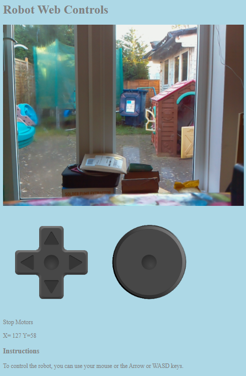
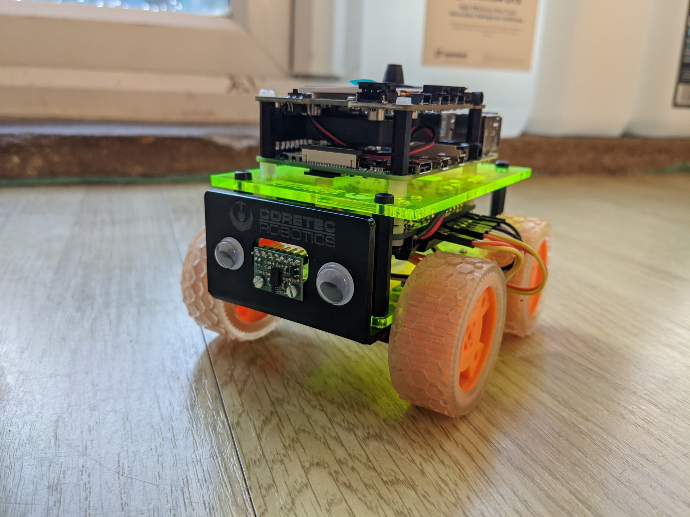

# WebRobotControl



A simple web interface for controlling your Raspberry Pi robot over the internet or your LAN.
This project is written in Python3, JavaScript and uses the Python library Flask for hosting the web app.

There are three index pages, index.html, index2.html and video.html. index.html code is more simple but does not have the circle pad control. 
You will need to change line 145 in appControl.py to point to the template you wish to use. if you are using the video template you will also need to change line 17 in video.html to point to your camera.

```
 return render_template('index2.html', **templateData)
 ```
 to
 ```
  return render_template('index.html', **templateData)
```
 or
```
  return render_template('video.html', **templateData)
```
 

## The Robot



The Robot("Testbed"), I used for testing is based on a Custom Coretec Robotics Tiny 4WD Chassis\* and a kit\** is available from [Pimoroni](https://shop.pimoroni.com/products/coretec-tiny-4wd-robot-rover). Testbed's brains are a Raspberry Pi 4 model B with an [Adafruit Brain hat](https://www.adafruit.com/product/437) for user interface duties and an [Adafruit Motor Bonnet](https://www.adafruit.com/product/4280) for controlling the four 300:1 N20 micro metal gearmotors. Power for the motors and the Raspberry Pi(via a DC-DC converter) is supplied by a 2 cell LiPo battery. 

Other robot kits I would recommend are the [CamJam Robot kit](https://thepihut.com/collections/camjam-edukit/products/camjam-edukit-3-robotics) a great kit to start learning robotics with and has excellent learning resources available. Any of the [4tronix](https://shop.4tronix.co.uk/collections/robot-kits) kits.


**WARNING: Take care when using LiPo's they can make your life interesting in all the wrong ways!**

 \* Full disclosure, I'm (Brian Corteil) the designer of the Coretec Tiny 4WD and receive a royalty for each kit sold by Pimoroni.

\** The kit sold by Pimoroni includes their wonderful [Explorer Phat](https://shop.pimoroni.com/products/explorer-phat) not the Adafruit Motor Bonnet.

## Dependencies

### Raspberry Pi OS

Install the latest verson of Raspberry Pi OS to a SD card, follow the instructions on the Raspberry Pi [website](https://www.raspberrypi.org/software/)

### Flask

Flask is a Python library for creating web apps and has a light weight webserver for testing, the web server is not recommended for production use. More details about Flask [here.](https://flask.palletsprojects.com/en/1.1.x/)

Install flask by using the command line by entering the following

```
pip3 install Flask
```

### Video streamimg

For streaming the Raspberry Pi camera I used the [streameye project](https://github.com/ccrisan/streameye) by Calin Crisan. To download it enter the following on the command line

```
git clone https://github.com/ccrisan/streameye.git
```

### Your libraries

You will also need to install any libraries you require if they are not part of the standard Raspberry Pi OS Python3 install.

## Download the code

Enter the following at the command line to download the project's code

```
git clone https://github.com/OpenPiRobotics/WebRobotControl.git
```

## Modify the appControl.py for your motor controller

You may need to modify the appControl.py to suit your motor controller.

modify line 42 to import your motor controller library
```
from adafruit_motorkit import MotorKit
```
and line 44 to setup your motor controller.
```
mh = MotorKit()
```

Modify the function set_speeds if required.

Change the lines 59 to 62, delete or hash out lines 61, 62, if your controller has only 2 channels
```
mh.motor1.throttle = power_right
mh.motor2.throttle = power_right
mh.motor3.throttle = power_left
mh.motor4.throttle = power_left
```

You may also need to change the values in the calls for setting your motors speeds in the function **action** starting from line 132. The Adafruit motor bonnet uses a float value between 0 and 1.

## Running the Code

**Note:** It is important not to change the project's folder structure for the code to work.

Run the appControl.py in the root of the project with.
```
python3 appControl.py
```
To start the Web interface use the web browser of your choice and enter the following replacing \<ip address\> with the IP address of your robot or it's host name and \<port\> is the port defined on line 165 of appControl.py
 ```
 http://<ip address>:<port>
 ```
 
 For example when I'm at home to access the web control interface, I would enter 
 ```
 testbed.lan:5080
 ```
 and if I wish to start the camera streaming I would enter before starting appControl.py
```
python3 /home/pi/streameye/extras/raspimjpeg.py -w 640 -h 480 -r 10 --vflip --hflip | streameye &
```

 
 for debuging the web interface press F12 in your web browser with the page loaded.
